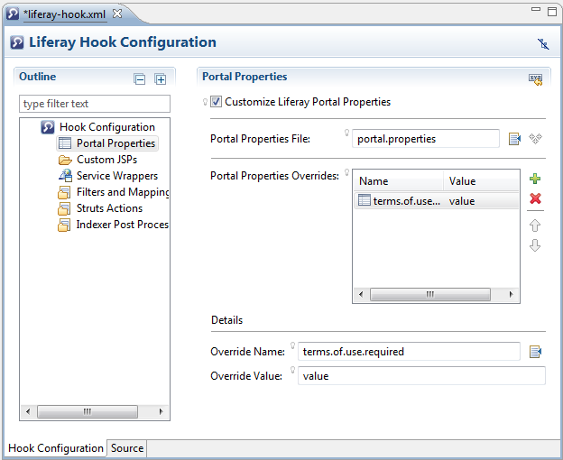
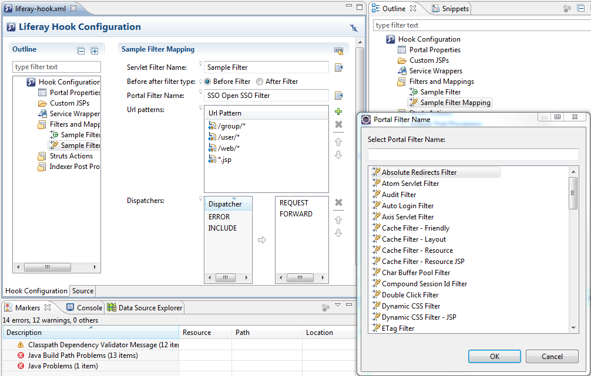
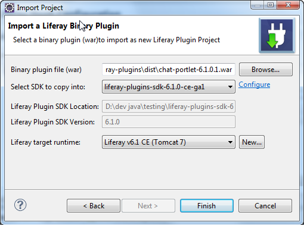

# Liferay IDE 1.5 Release

----------

## Previous Liferay IDE 1.4 New and Noteworthy

- Liferay 6.1(Tomcat 7) Server
- Portlet Config Editor
- See entire [1.4 Release page here](https://www.liferay.com/community/wiki/-/wiki/Main/Liferay+IDE+1.4+Release)

## New features in 1.5

**Liferay Hook Configuration Editor**

A new configuration editor for Liferay Hook has been added that adds advanced editing capability to `liferay-hook.xml` files. This complements the Liferay Hook Wizard that makes it easy to add new `portal.properties` or new `custom jsps` to your project after the initial hook wizard. 

Additional editing support in `liferay-hook` includes:

- Specifying servlet filter hooks
- Overriding liferay portal struts actions
- Index post processors

**Import wizards for Liferay Binary Plugins**

Using the new Import wizard you can import existing plugins from binary war into Liferay IDE as a source project. 

**Other enhancements**

- JSP Debugging for Remote Liferay Servers
- Remote Glassfish server support

